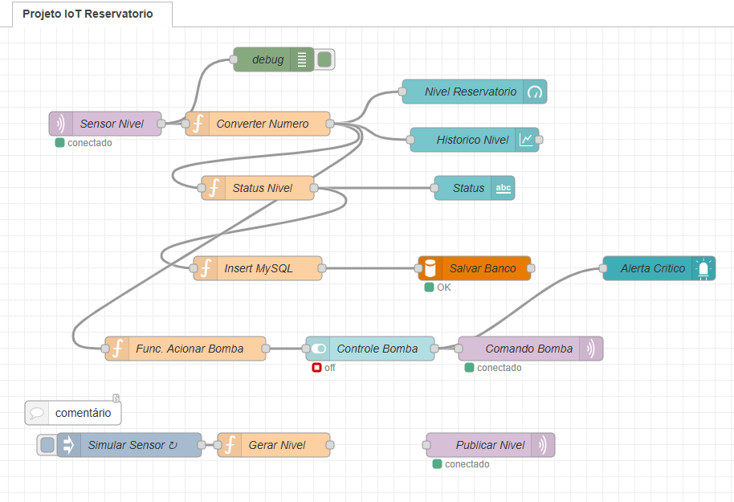

# **Projeto IoT – Monitoramento de Reservatório com ESP32**

## Descrição

Este projeto tem como objetivo o desenvolvimento de uma aplicação completa de **Internet das Coisas (IoT)** para monitoramento de nível de um reservatório de água e acionamento automátio de uma bomba ligada a um poço artesiano para encher o reservatório caso seja necessário.

Foram utilizados:
* Microcontrolador ESP32
* Comunicação via MQTT
* Servidor em nuvem (AWS)
* Dashboard interativo com Node-RED
* Banco de dados MySQL

O sistema permite:

* Monitoramento em tempo real
* Armazenamento de dados
* Acionamento automático de bomba
* Visualização gráfica via dashboard

---

# **Arquitetura do Sistema**

```
ESP32 → MQTT → Node-RED → Dashboard
                 ↓
               MySQL
                 ↓
            Controle Bomba (MQTT)
```

---

# **Tecnologias Utilizadas**

* Microcontrolador: ESP32
* Comunicação: MQTT / HTTP
* Servidor: Amazon Web Services (EC2 Ubuntu)
* Backend: Node-RED
* Banco de dados: MySQL
* Broker MQTT: Mosquitto
* Linguagem: C++ (Arduino)

---

# **Montagem do Circuito**

## 📷 Diagrama do Circuito

)

---

## 🔗 Ligações dos Componentes

### ESP32

| Componente          | Pino ESP32 |
| ------------------- | ---------- |
| Potenciômetro (SIG) | GPIO 34    |
| LED                 | GPIO 1     |
| ST7789 SCL          | GPIO 18    |
| ST7789 SDA          | GPIO 23    |
| ST7789 DC           | GPIO 16    |
| ST7789 CS           | GPIO 5     |
| ST7789 RES          | GPIO 17    |
| VCC                 | 3.3V       |
| GND                 | GND        |

---

### Potenciômetro (10k)

| Pino | Ligação |
| ---- | ------- |
| VCC  | 3.3V    |
| GND  | GND     |
| SIG  | GPIO 34 |

---

### LED

| Pino       | Ligação                    |
| ---------- | -------------------------- |
| Anodo (+)  | GPIO 1 (com resistor 1KΩ) |
| Catodo (-) | GND                        |

---

### Display ST7789

| Pino | Ligação |
| ---- | ------- |
| VCC  | 3.3V    |
| GND  | GND     |
| SCL  | GPIO 18 |
| SDA  | GPIO 23 |
| DC   | GPIO 16 |
| RES  | GPIO 17 |
| CS   | GPIO 5  |

---

# **Código ESP32**

Arquivo: `Monitor_e_acionamento-wifi.ino`

## Funcionalidades:

* Conexão WiFi
* Comunicação MQTT
* Leitura analógica (nível)
* Exibição no display
* Controle de LED
* Publicação no tópico MQTT


---

# **Servidor em Nuvem**

## Configuração AWS

Instância:

* Ubuntu 20.04
* Portas liberadas:

  * 22 (SSH)
  * 1880 (Node-RED)
  * 1883 (MQTT)
  * 80 (HTTP)

---

# **Node-RED**

## Fluxo



Arquivo:

```
flow Node-Red - Monitor Reservatorio.json
```

---

## Principais Funcionalidades

### Recebimento MQTT

Tópico:

```id="c2e3m4"
sensor/nivel
```

---

### Processamento

Converte e classifica nível:

```javascript
if(nivel < 20){
 status = "CRITICO"
}
```

---

### Dashboard

* Gauge (nível)
* Gráfico histórico
* Status textual
* LED de alerta

---

### Banco de Dados

Query:

```sql
INSERT INTO sensores (nivel,status)
VALUES (valor, status)
```

---

### Controle de Bomba

Lógica:

* Liga: nível < 20
* Desliga: nível > 80

Publica em:

```id="qf6wrz"
sensor/bomba
```

---

# **Banco de Dados MySQL**

## Estrutura

```sql
CREATE DATABASE iot;

USE iot;

CREATE TABLE sensores (
    id INT AUTO_INCREMENT PRIMARY KEY,
    nivel INT,
    status VARCHAR(20),
    data TIMESTAMP DEFAULT CURRENT_TIMESTAMP
);
```

---

# **Comunicação MQTT**

## Tópicos utilizados

| Tipo           | Tópico       |
| -------------- | ------------ |
| Envio ESP32    | sensor/nivel |
| Controle bomba | sensor/bomba |

---

## 2️⃣ Acessar dashboard

```
http://18.210.29.178:1880/ui
```

## 3️⃣ Monitoramento

* Nível em tempo real
* Histórico
* Status automático
* Controle da bomba

---

# **Estrutura do Repositório**

```
📦 projeto-iot-reservatorio
 ┣ 📂 esp32
 ┃ ┗ Monitor_e_acionamento-wifi.ino
 ┣ 📂 node-red
 ┃ ┗ flow.json
 ┣ 📂 imagens
 ┃ ┣ circuito.png
 ┃ ┗ dashboard.png
 ┣ 📂 docs
 ┃ ┗ README.md
```


# **Autor**
Flatelo Araujo

  Projeto de IoT desenvolvido para disciplina do professor Marcos Chaves do Instituto Federal de São Paulo Campus Catanduva.


